# Zink - A Modern Transit Solution 🚌

## 🎖 Award Recognition For Capstone Project, Conestoga College. 🏆

This project was awarded the **"Best of Program"** for the Mobile Solutions Development Capstone Project at Conestoga College.

## 📖 Project Overview
Zink is an App that provides an integrated solution to Public Transit Access Management in a way that makes sense to the users, providing deals & packages for transit passes that give you access to the services you use the most, depending on where you live & travel to. This capstone project demonstrates the integration of various modern technologies to create a robust mobile solution. The project leverages the power of **React Native with TypeScript** to deliver a seamless user experience supported by a **Node.js** backend and much more.

## 🛠 Technologies Used
- **Frontend:**
  - ⚛️ React Native with TypeScript
  - 🎨 Framer for design prototypes and mockups

- **Backend:**
  - 🟢 Node.js
  - 🔥 Firebase for database storage

## ✨ Key Features

- **Authentication:**
  - 🔐 Sign up with Google
  - 📲 OTP verification for secure access

- **Communication:**
  - 📧 SendGrid for sending emails

- **Database:**
  - 🔥 Firebase for storing user data and other information

- **Design:**
  - 🎨 Prototyping and mockups created using Framer

- **Payments:**
  - 💳 Integration of various payment methods for a seamless transaction experience

- **Security:**
  - 🔒 QR Code Generator with 256-bit Encryption

- **Localization:**
  - 🌐 French and English Language Support

- **User Experience:**
  - 🌗 Light and Dark Mode

## 📸 Screenshots

  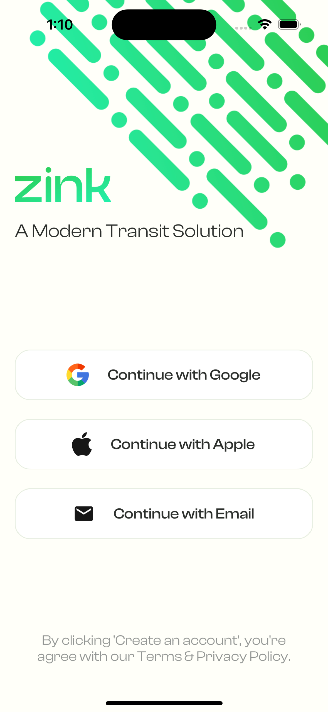
  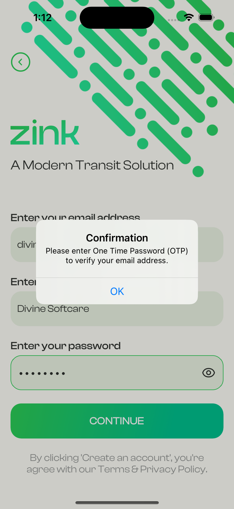
  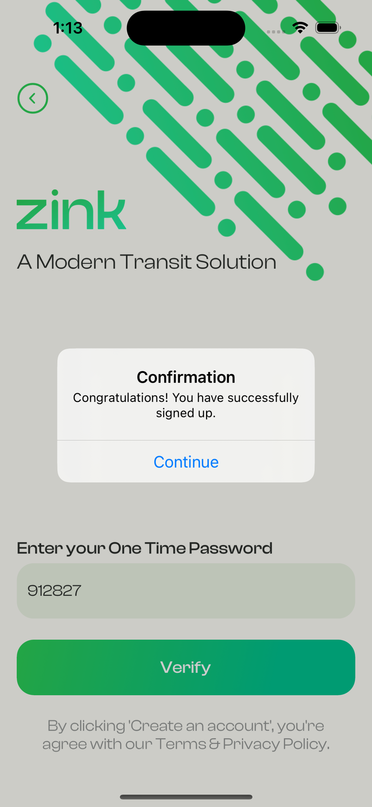
  
  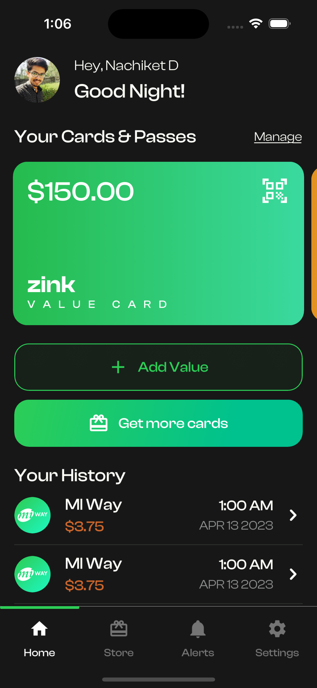
  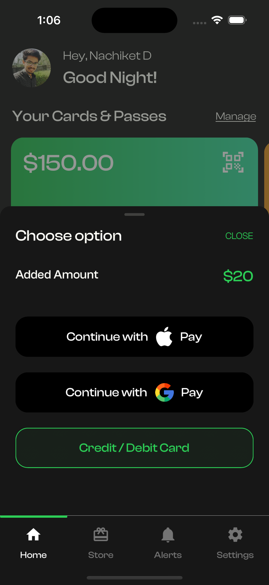
  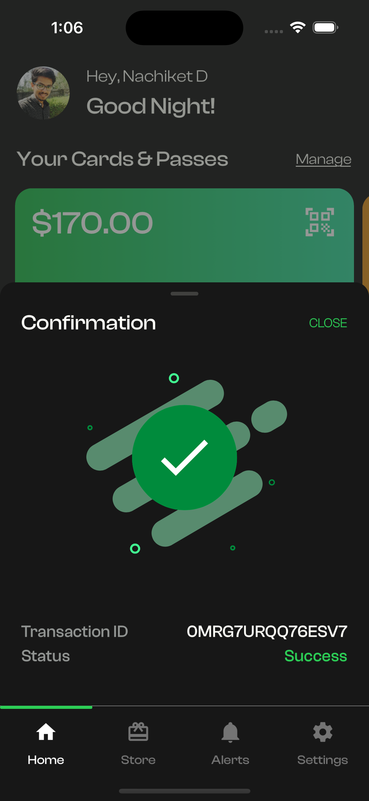
  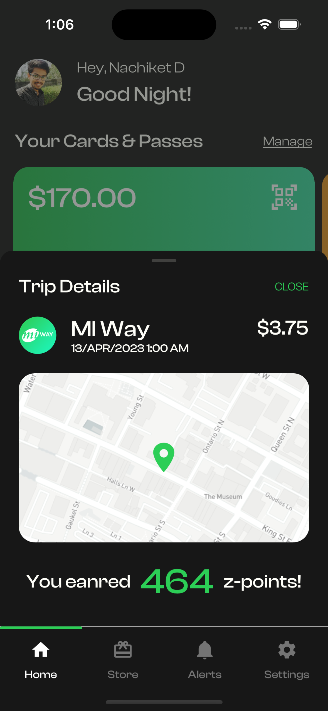
  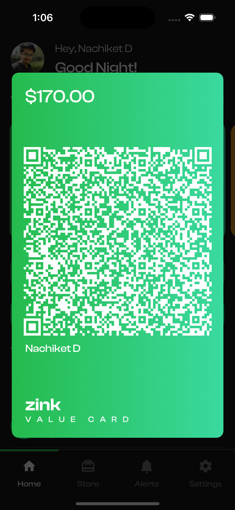
  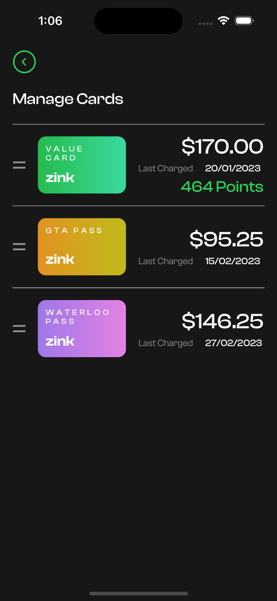
  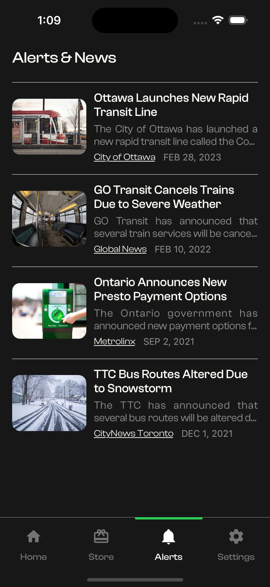
  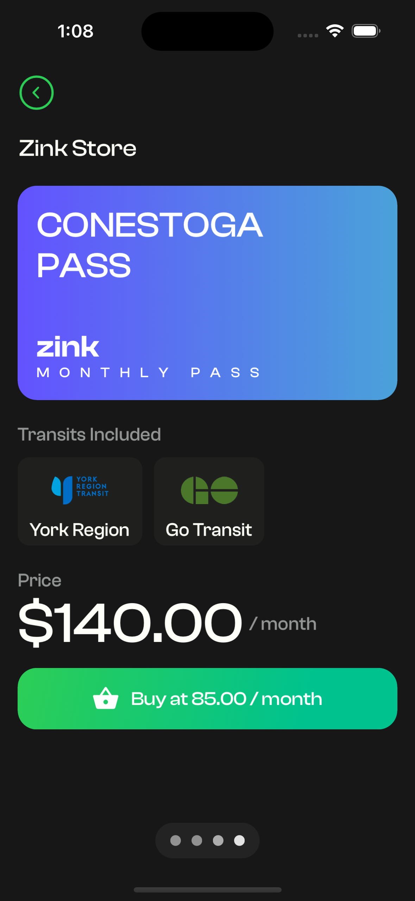
  
  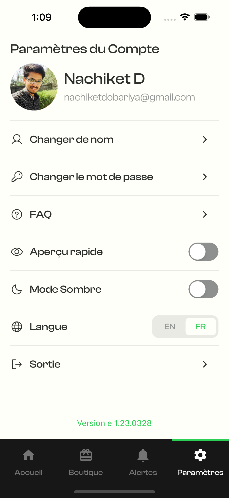
  

## 📸 Scanner APP Screenshots

  

## 🖼 Award Image

